# Case Study #001 — Posso Farlo Io

## Stato del progetto

**Tipo di progetto:** Concept Project  
**Cliente:** Posso Farlo Io — Giunta Francesco  
**Stato:** Concept dimostrativo, non commissionato  
**Obiettivo:** mostrare come una presenza digitale più chiara, credibile e orientata al contatto possa supportare un artigiano edile attivo tra Arco, Riva del Garda e comuni limitrofi.

> Questo progetto non rappresenta un sito definitivo approvato dal cliente.  
> Testi, immagini, servizi, recapiti e contenuti devono essere verificati prima di qualsiasi pubblicazione reale.

---

## 1. Contesto iniziale

Posso Farlo Io è un’attività artigiana nel settore edile, con esperienza operativa sul territorio dell’Alto Garda.

Il progetto è nato dall’osservazione di un’esigenza comune a molte piccole attività locali:

- comunicare in modo più chiaro cosa viene offerto;
- trasmettere affidabilità e competenza;
- facilitare il primo contatto;
- ridurre la distanza tra cliente e professionista;
- presentare i servizi in modo comprensibile, senza tecnicismi inutili.

L’obiettivo non era semplicemente “creare un sito”, ma costruire un concept capace di dimostrare come una presenza digitale possa sostenere la relazione commerciale.

---

## 2. Problemi e opportunità osservati

### Problemi principali

1. **Offerta poco strutturata**

   I servizi rischiano di essere percepiti come un elenco generico di lavorazioni, senza spiegare il beneficio concreto per il cliente.

2. **Assenza di un percorso chiaro**

   Un potenziale cliente potrebbe non capire cosa succede dopo il primo contatto, quali sono le fasi e come viene gestito il lavoro.

3. **Fiducia poco valorizzata**

   L’esperienza personale, il referente unico e la conoscenza del territorio sono elementi forti, ma devono essere comunicati in modo esplicito.

4. **Contatto poco guidato**

   Un semplice numero di telefono non aiuta il cliente a spiegare bene la richiesta. Serve un sistema che faciliti la raccolta delle informazioni iniziali.

5. **Portfolio non ancora pronto**

   Le immagini definitive dei lavori non sono ancora disponibili o validate. Mostrare fotografie come se fossero reali sarebbe scorretto.

### Opportunità

- valorizzare l’esperienza diretta di Francesco;
- comunicare il vantaggio di avere un unico referente;
- presentare il processo di lavoro in sei fasi;
- usare WhatsApp come canale principale di contatto;
- creare una base visiva pronta da completare con contenuti reali;
- dimostrare un approccio concreto e orientato alle priorità.

---

## 3. Ipotesi formulate

Sono state formulate queste ipotesi:

1. Un messaggio chiaro e diretto può aumentare la comprensione immediata dell’offerta.
2. La presenza di benefici concreti nei servizi può rendere il sito più utile rispetto a un semplice elenco tecnico.
3. Un metodo di lavoro esplicito può ridurre dubbi e diffidenza.
4. Un referente unico può diventare un elemento distintivo.
5. Un form che prepara il messaggio WhatsApp può migliorare la qualità del primo contatto.
6. Una comunicazione trasparente sulle immagini dimostrative evita ambiguità e mantiene credibilità.

---

## 4. Soluzioni progettate

### Hero principale

La hero è stata costruita per comunicare subito:

- tipo di attività;
- area geografica;
- esperienza;
- responsabilità;
- contatto diretto via WhatsApp.

Messaggio principale:

> Lavori edili fatti con esperienza, precisione e responsabilità.

### Sezione servizi

I servizi non vengono presentati solo con il nome tecnico, ma anche con il beneficio:

- Ristrutturazioni  
  Per trasformare gli ambienti e renderli più funzionali.

- Tinteggiature  
  Per rinnovare gli spazi con finiture pulite e curate.

- Cartongesso  
  Per organizzare meglio gli ambienti e creare nuove soluzioni.

- Pavimenti e rivestimenti  
  Per dare agli spazi una base resistente e coerente.

- Rasature e finiture  
  Per superfici precise, pronte per la finitura finale.

- Manutenzioni edili  
  Per risolvere rapidamente piccoli e grandi problemi.

### Metodo di lavoro

Il processo è stato suddiviso in sei fasi:

1. Primo contatto
2. Valutazione
3. Sopralluogo
4. Preventivo
5. Esecuzione
6. Consegna

Questa struttura rende il percorso più prevedibile e comprensibile.

### Sezione “Chi sono”

La sezione valorizza:

- comunicazione diretta;
- esperienza sul campo;
- attenzione alle esigenze;
- presenza di un unico referente.

### Portfolio dimostrativo

Il portfolio mostra il funzionamento della futura galleria, ma specifica chiaramente che:

- le immagini sono dimostrative;
- non rappresentano lavori definitivi;
- i contenuti reali dovranno essere selezionati con il cliente.

### Contatti

Il form non invia automaticamente dati.

Prepara invece un messaggio WhatsApp con:

- nome;
- comune;
- tipo di lavoro;
- descrizione della richiesta.

Questo riduce l’attrito e migliora la qualità delle informazioni iniziali.

---

## 5. Scelte escluse perché non prioritarie

Non sono state incluse in questa fase:

- area riservata;
- database;
- automazioni complesse;
- preventivi automatici;
- prenotazione appuntamenti;
- blog;
- SEO avanzata;
- cookie banner;
- privacy policy definitiva;
- dominio personalizzato;
- tracciamenti avanzati;
- sistemi di pagamento;
- gestione clienti.

Queste funzioni non sono necessarie per validare il concept e avrebbero aumentato complessità, tempi e costi senza un beneficio immediato.

---

## 6. Tecnologie utilizzate

Il concept è stato realizzato con:

- HTML
- CSS
- JavaScript vanilla
- Three.js per gli elementi WebGL

Non sono stati utilizzati framework come React o Vue.

### Motion design

Sono stati integrati:

- reveal allo scroll;
- stagger;
- parallax;
- tilt 3D del logo;
- shine effect;
- animazioni coordinate;
- supporto `prefers-reduced-motion`;
- gestione tramite `IntersectionObserver`;
- ottimizzazione tramite `requestAnimationFrame`.

### WebGL

La hero include:

- wireframe architettonici;
- griglia;
- linee arancioni;
- particelle;
- movimento lento;
- risposta minima a mouse e scroll;
- sospensione del rendering fuori viewport;
- riduzione degli effetti su mobile;
- fallback in caso di problemi.

---

## 7. Risultato del concept

Il risultato è un sito dimostrativo che:

- comunica chiaramente il posizionamento;
- valorizza l’esperienza;
- spiega il metodo;
- presenta i servizi in modo orientato al beneficio;
- facilita il contatto;
- mantiene trasparenza sui contenuti ancora da validare;
- funziona su desktop e mobile.

Il concept è stato valutato come sufficientemente maturo per essere presentato, senza ulteriori perfezionamenti non necessari.

---

## 8. Limiti del progetto

Il progetto presenta limiti intenzionali:

- non è stato commissionato dal cliente;
- i testi non sono ancora approvati;
- la foto di Francesco deve essere verificata;
- le immagini del portfolio sono dimostrative;
- i recapiti devono essere confermati;
- non è presente documentazione legale definitiva;
- non è stata eseguita una validazione reale con utenti o clienti;
- non sono disponibili dati sulle conversioni;
- non è possibile misurare risultati commerciali in questa fase.

Qualsiasi pubblicazione reale richiede una revisione con il cliente.

---

## 9. Materiale visivo

### Desktop

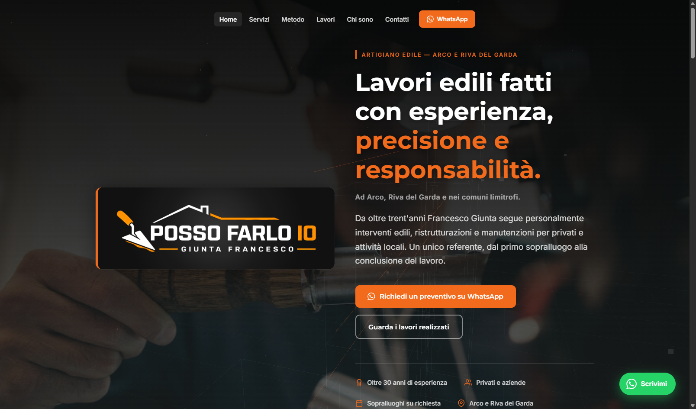

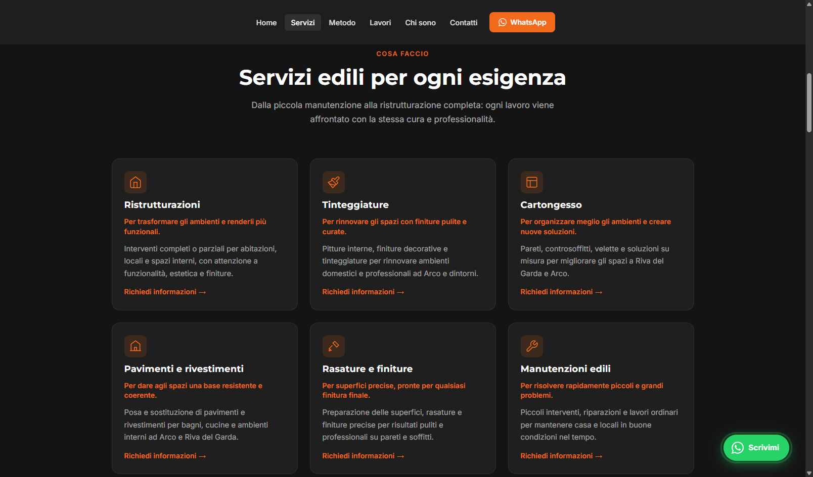

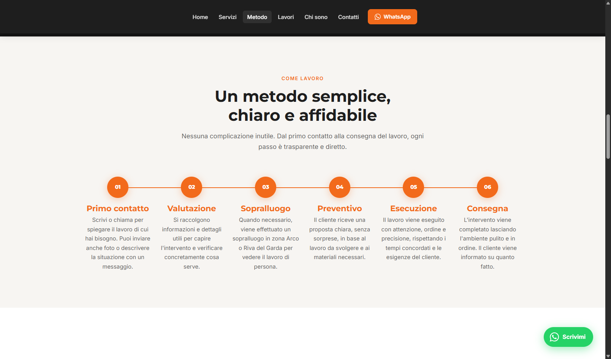

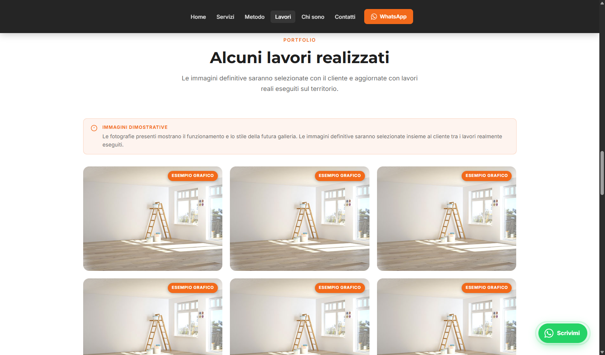

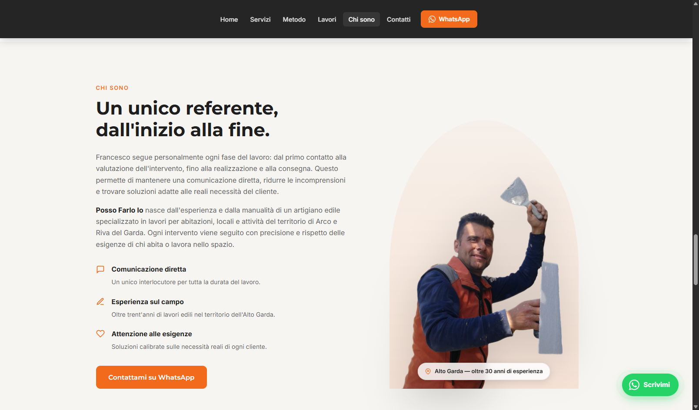

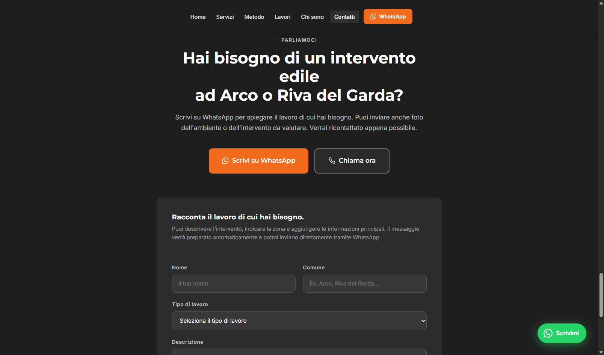

### Mobile

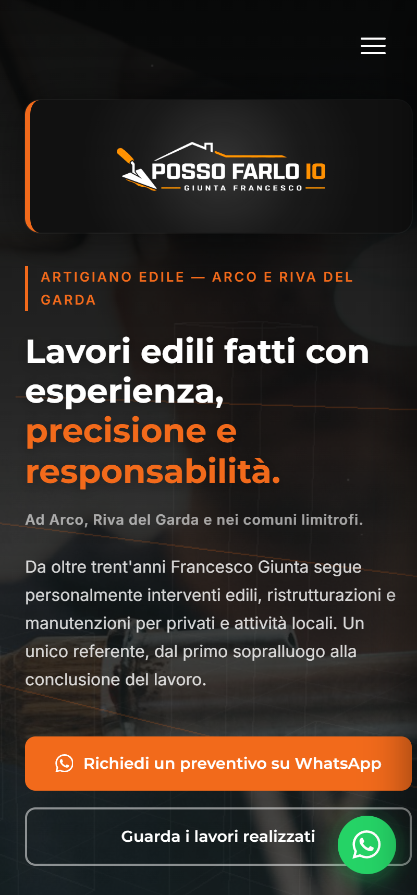

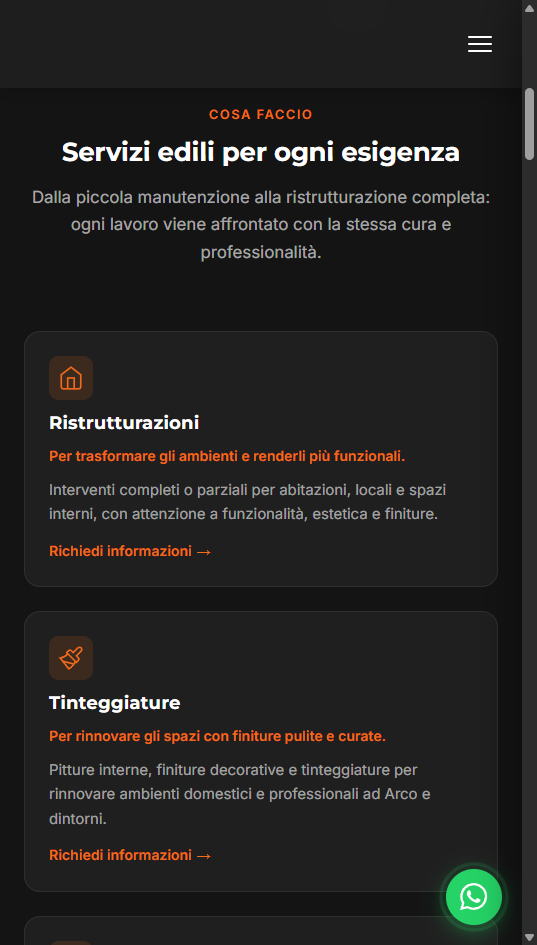

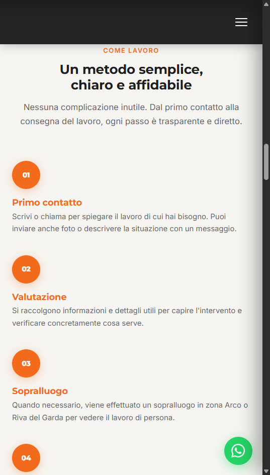

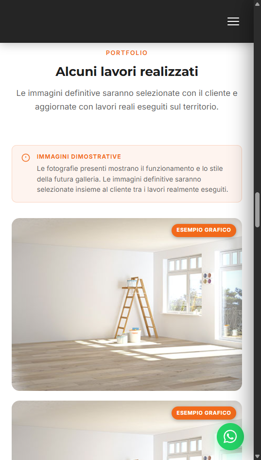

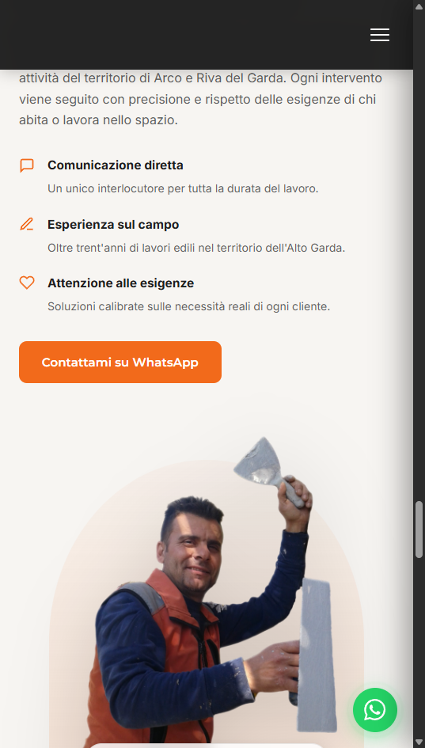

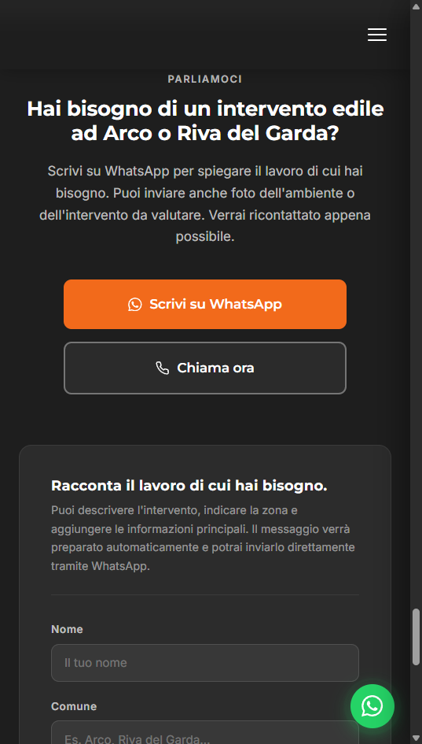

---

## 10. Prossimi passi realistici

1. Presentare il concept a Francesco.
2. Verificare interesse e priorità reali.
3. Confermare servizi, testi, recapiti e area geografica.
4. Raccogliere fotografie reali dei lavori.
5. Definire eventuale proposta economica.
6. Separare chiaramente:
   - analisi;
   - realizzazione;
   - manutenzione;
   - servizi aggiuntivi.
7. Pubblicare solo dopo approvazione e completamento dei requisiti legali.

---

## Conclusione

Questo progetto dimostra il metodo di The North Project:

1. osservare;
2. formulare ipotesi;
3. verificare;
4. proporre poche azioni ad alto impatto;
5. misurare il risultato.

Il valore del concept non risiede soltanto nel sito realizzato, ma nella capacità di trasformare una presenza digitale generica in uno strumento più chiaro, credibile e orientato alla relazione con il cliente.
